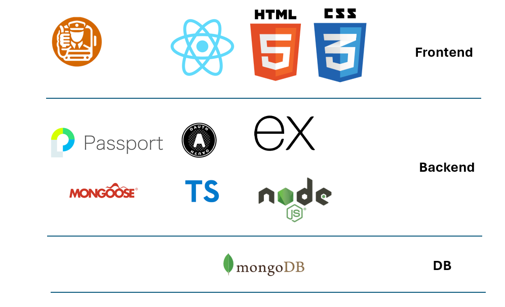

# Digital Empowerment Challenge
# Solution: Tip'n'Tap Web App

## Description 
Our vision is to uplift bus drivers' morale and enhance commuter experiences by leveraging positive interactions and financial incentives through a digital tipping app, "Tip'n'Tap." This app allows commuters in Singapore, where bus drivers are often perceived as unfriendly due to low morale, to tip and rate their drivers immediately after their journey, focusing on friendliness, safety, and punctuality. We aim to test whether this tipping system can mitigate the bus driver shortage and improve the overall public transport experience.

## Demo Video
[Placeholder]

## Architecture Diagram 


## Features

### Appreciation Mechanism
- **Digital Tipping:** Allows commuters to give monetary tips to drivers as a token of appreciation.

## Tech Stack
This project is built using the MERN stack:
- **MongoDB:** Document-oriented nosql database program used by the back end application to store data.
- **Express.js:** Back end web application framework running on top of Node.js.
- **React:** A JavaScript library for building user interfaces.
- **Typescript/Node.js:** A JavaScript runtime built on Chrome's V8 JavaScript engine.
- **MVC:** The MVC (Model-View-Controller) design pattern is a way to organize code in software applications to separate the representation of information from the user's interaction with it.
- **Google API Console:** OAuth 2.0 protocol for authentication and authorization

## Getting Started
To get a local copy up and running follow these simple steps:

1. Clone the repo
   ```
   git clone https://github.com/your-username/your-project-name.git
   ```
2. Install NPM packages
   ```
   npm install
   ```
3. Enter your configuration in `.env`
   ```
   DATABASE_URL=your_database_url
   ```
4. Run the application
   ```
   npm start
   ```

## Contribution
Contributions are what make the open-source community such an amazing place to learn, inspire, and create. Any contributions you make are **greatly appreciated**.

1. Fork the Project
2. Create your Feature Branch (`git checkout -b feature/AmazingFeature`)
3. Commit your Changes (`git commit -m 'Add some AmazingFeature'`)
4. Push to the Branch (`git push origin feature/AmazingFeature`)
5. Open a Pull Request

## License
Distributed under the MIT License. See `LICENSE` for more information.

## Contact
Your Name - [Cristopher Meidivo Harsono](mailto:Cristoph001@mymail.sim.edu.sg)
Project Link: [Tip'n'Tap](https://github.com/trxs-7/angel-hack-singapore)
